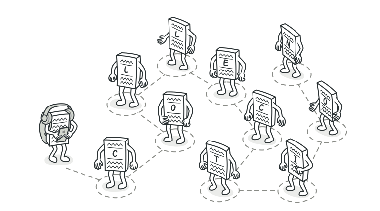
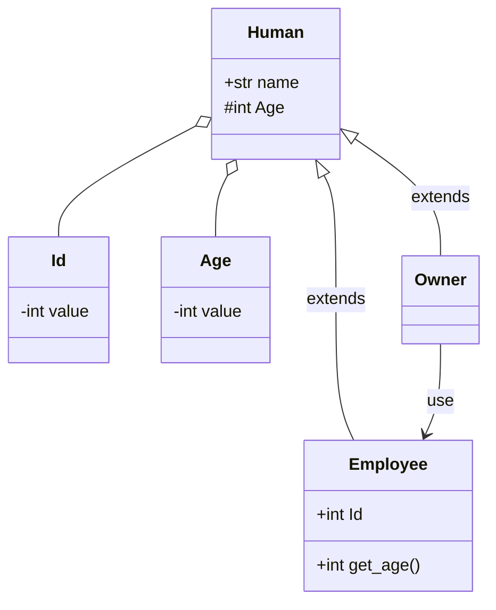
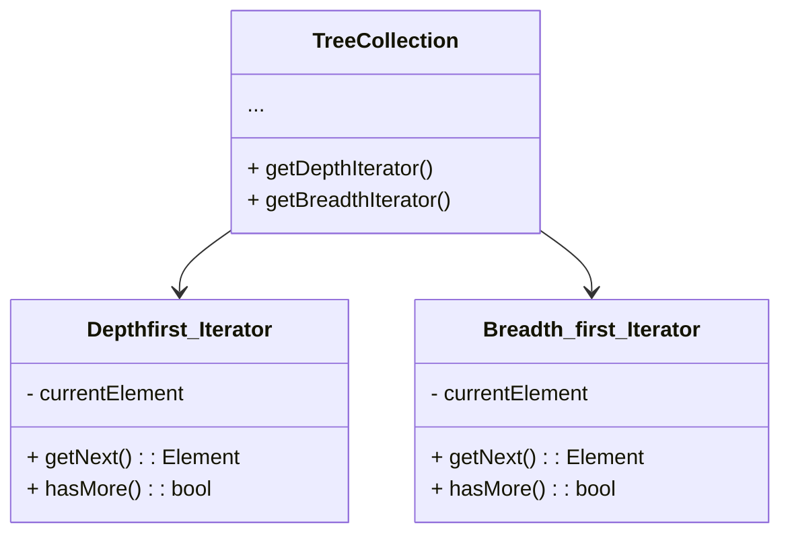

# Iterationパターン
[refactoring・guru・より引用](https://refactoring.guru/ja/design-patterns/iterator)



Iteratorパターンは要素の集まりを保有するオブジェクトの各要素に順番にアクセスする方法を提供するためのパターン

例えばListオブジェクトを用いて各要素への様々なアクセス方法が考えられる。
名前順にアクセスするのか、値の大小なのかなどなど
これらの「走査方法」は目的によって様々なので、List側のみで提供することはできない

⇒この走査方法の提供元の設計をするためのデザインパターンが**Iteratorパターン**と呼ばれるもの。

データを集約したオブジェクト自身に処理をもたせないような
外部実装をもつことで、オブジェクト自体の変更にも柔軟に対応ができるような設計となる。

### クラス図
関係ないけどmermaid入れてみました。

markdownでクラス図もかけるよ。すごい。

サンプル）



## 問題
データの入れ物であるコレクションについて、
データの探索を効率的に行う方法を考えたい。

この際にコレクションの構造に関わらずに、他のコードがコレクションの要素を使えるようにしたい。
これをコレクションに対して探索処理をもたせると、
データの格納場所としての意義が薄れてしまう。

→開発者はデータがどのように格納されているかを意識したくないし、コレクションの構造に関わらず横断的にデータの走査をしたい

## 解決策
Iteratorパターンの基本的な考えは、コレクションに対する探索のふるまいを「**イテレータ（反復子）**」と呼ばれるオブジェクトに抽出すること



# RustでIteratorパターン
## standard iterator
慣用的に用いられるRustコードにおいてiteratorオブジェクトは使われている
```
let array = &[1, 2, 3];
let iterator = array.iter();

fo val in iterator {
    println!("Got: {} ", val);
}
```

## Custom Iterator
イテレータをカスタマイズするケース
Rustが推奨する方法はIteratorトレイトを実装する方法

```
let users = UsersCollection::new();
let mut iterator = users.iter();

iterator.next();

// UsersCollectionというコレクション（構造体）にIteratorトレイトを実装する
pub struct UserCollection {
    users: [&'static str; 3],
}

impl UserCollection {
    pub fn new() -> Self {
        Self {
            users: ["Alice", "Bob", "Carl"],
        }
    }

    pub fn iter(&self) -> UserIterator {
        UserIterator {
            index: 0,
            user_collection: self,
        }
    }
}

pub struct UserIterator<'a> {
    index: usize,
    user_collection: &'a UserCollection,
}

impl Iterator for UserIterator<'_> {
    type Item = &'static str;

    fn next(&mut self) -> Option<Self::Item> {
        if self.index < self.user_collection.users.len() {
            let user = Some(self.user_collection.users[self.index]);
            self.index += 1;
            return user;
        }
        None
    }
}
```