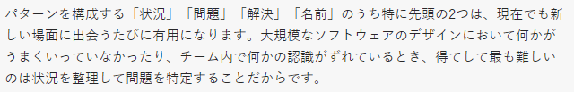
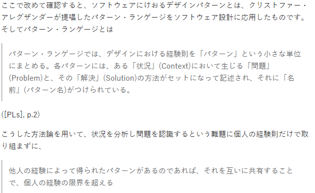

# 概要
デザインパターンの基礎を理解する

<del>⇒教育用の資料として使うことを目的にまとめる。</del>と言ったな。あれは嘘だ。

いくつかの言語でのデザインパターンの例を学ぶ
（恐らくRustを中心に学ぶ予定）

# デザインパターンが古いという意見がありますが
[QuoraにこんなQAがありました](https://jp.quora.com/%E4%B8%80%E6%99%82%E6%9C%9F%E3%83%97%E3%83%AD%E3%82%B0%E3%83%A9%E3%83%9F%E3%83%B3%E3%82%B0%E3%81%AE%E3%83%87%E3%82%B6%E3%82%A4%E3%83%B3%E3%83%91%E3%82%BF%E3%83%BC%E3%83%B3%E3%81%A8%E3%81%84%E3%81%86%E3%82%82)

まったくもっておっしゃる通りでした。
デザインパターンの意義は
こういう問題に直面したらこの解法で取り組めばいいよ。という安直な解法としての利用ではない事に注意。
重要なのは以下のお話でした。

GoFのカタログをもとにC++とかjavaの実装を正確に当てはめようとすることに躍起になるのは本末転倒。

これがすごいその通りに思える。
